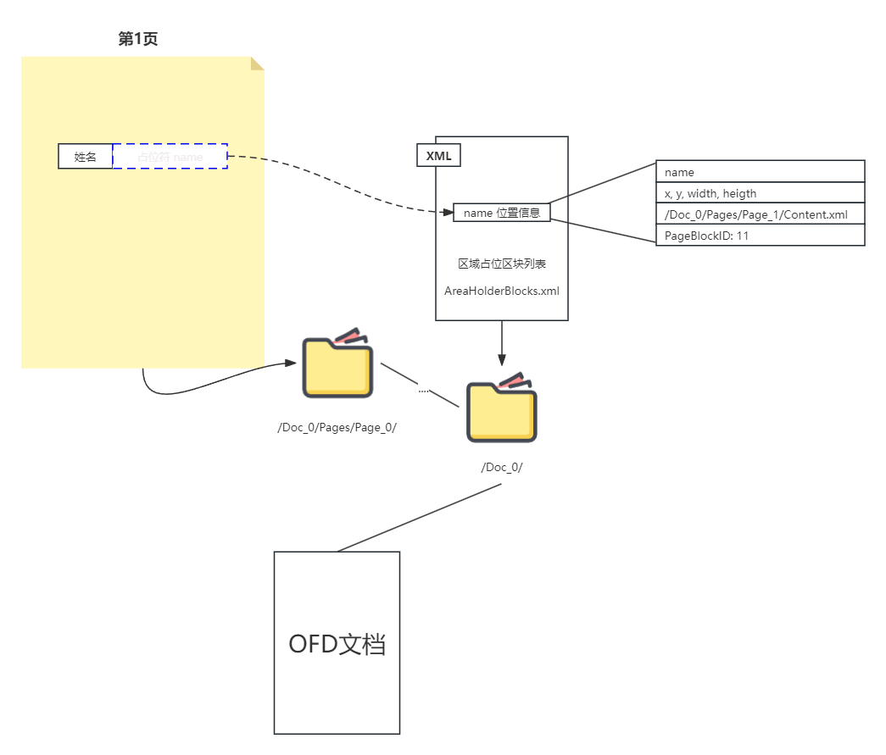
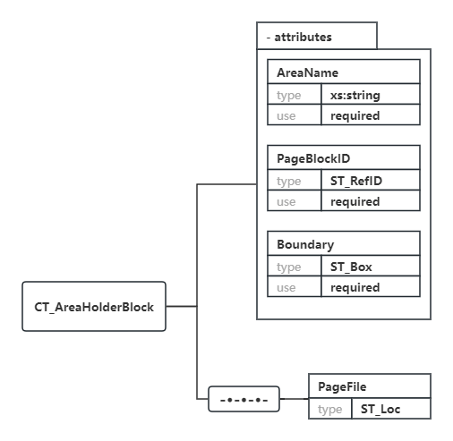

# 区域占位区块 设计及使用

## 1. 快速入门

通过使用 区域占位区块 可以实现类似表单的效果，在需要时向OFD页面添加内容。

- **注意：区域占位区块 功能为OFDRW自定义扩展内容，非OFD标准，仅在OFDRW库中有效！**
- **注意：区域占位区块 功能为OFDRW自定义扩展内容，非OFD标准，仅在OFDRW库中有效！**
- **注意：区域占位区块 功能为OFDRW自定义扩展内容，非OFD标准，仅在OFDRW库中有效！**

要使用 区域占位区块 您需按照如下步骤：

1. 添加 区域占位区块。
2. 使用 区域占位区块：编辑包含 区域占位区块 的文件，向指定区域添加内容。

### 1.1 添加

您可以通过OFDRW提供特殊的元素 [AreaHolderBlock](../../src/main/java/org/ofdrw/layout/element/AreaHolderBlock.java) 向OFD文档中添加 区域占位区块。

区域占位区块 与 普通Div对象没有太大差异，**add()** 到 **虚拟页面** 或 **文档** 中即可。

流式布局API示例如下：

```java
OFDDoc ofdDoc = new OFDDoc(out);
AdditionVPage avPage = ofdDoc.getAVPage(1);
// ...

AreaHolderBlock field = new AreaHolderBlock("name", 40.7d, 40d,100d, 10d);
avPage.add(field);

// ...
ofdDoc.close();
```

完整示例代码见：[AreaHolderBlockTest.java #testStreamDocAddArea](../../src/test/java/org/ofdrw/layout/element/AreaHolderBlockTest.java)


固定布局API示例如下：

```java
OFDDoc ofdDoc = new OFDDoc(out);
// ...

AreaHolderBlock field = new AreaHolderBlock("name", 100d, 10d);
ofdDoc.add(field);

// ...
ofdDoc.close();
```

完整示例代码见：[AreaHolderBlockTest.java #testAddVPage](../../src/test/java/org/ofdrw/layout/element/AreaHolderBlockTest.java)

### 1.2 使用

若您的OFD文件中包含了 **区域占位区块列表（AreaHolderBlocks.xml）** ，那么您就可以使用OFDRW在这些预留的空间位置生成OFD内容。

方法如下：

1. 打开文档。
2. 构造 AreaHolderContext 对象。
3. 通过 AreaHolderContext 获取指定区域的 Canvas 对象。
4. 通过Canvas绘制内容。
5. 关闭文档。

示例如下：

```java
// 1. 打开文档
OFDReader reader = new OFDReader(src);
OFDDoc ofdDoc = new OFDDoc(reader, dst);

// 2. 构造 AreaHolderContext 对象
AreaHolderContext holderCtx = new AreaHolderContext(ofdDoc);

// 3. 通过 AreaHolderContext 获取指定区域的 Canvas 对象
Canvas canvas = holderCtx.get("name");
if (canvas == null) {
    return;
}
// 4. 通过Canvas绘制内容
canvas.setDrawer((ctx) -> { /* ... */ });

// 5. 关闭文档
reader.close();
ofdDoc.close();
```
完整示例代码见：[AreaHolderContextTest.java #testGet](../../src/test/java/org/ofdrw/layout/areaholder/AreaHolderContextTest.java)

## 2. 工作原理

你可以通过下面信息，快速了解到 区域占位区块 的设计。

- 目的：在OFD生成后向指定区域生成内容。
- 如何实现：在OFD生成时，插入占位符，保存区域信息，编辑时读取区域信息。
- 实现细节：
  - 文件应位于什么地方：文档根目录。
  - 文件名称：AreaHolderBlocks.xml
  - 数据结构：采用xml描述
  - 通过 名称 找到 对应的区域
  - 通过 文件路径 找到 页面。
  - 通过 对象ID 找到页面的预置容器，内容生成于容器中。
  - 通过 外接矩形区域 设定绘制空间。
  - 通过 Canvas API 生成内容。
- 需要向页面内加入内容，不支持签名保护。

区域占位区块 分为 **区域占位区块 生成** 和 **区域占位区块 使用** 两部分内容。

### 2.1 区域占位区块 生成

OFDRW提供特殊的元素 [AreaHolderBlock](../../src/main/java/org/ofdrw/layout/element/AreaHolderBlock.java) 
开发者可以使用layout模块文档API，在生成文档的时候插入 **区域占位区块**，区域占位区块与一个普通的`Div`元素类似，它的作用是在生成文档时，将区域信息保存到文档中。

在生成OFD图元时，每个 区域占位区块 都会将会往页面内容中加入一个空白的页块对象（CT_PageBlock）作为容器，同时还会在文档的根目录创建一个用于保存位置信息的列表文件（AreaHolderBlocks.xml）。

为了让您在需要时候找到这个 区域占位区块 ，您还需要额外为其指定 **区域名称**，这个区域名称在文档中应该是唯一的。

原理如下图所示：



上图中在OFD的第1页处添加了一个名为 `name` 的 区域占位区块，该占位区域的位置信息都被保存到`/Doc_0/AreaHolderBlocks.xml` 文件中。

### 2.2 区域占位区块 使用

若OFD文件包含 **区域占位区块列表（AreaHolderBlocks.xml）** ，那么您就可以使用OFDRW在这些预留的空间位置生成OFD内容。

首先OFDRW会解析位于文档根目录中`AreaHolderBlocks.xml`文件，以获得一系列的位置信息，开发者可以通过  **区域名称** 从中找到对应的区域占位区块。

然后通过 **区域占位区块** 中的信息，可以依次找到该区域所处的页面以及区域位置和大小，并返回一个用于绘制内容的Canvas对象，利用Canvas API便可以在预置的区域中绘制图形图像内容了。

其原理如下图所示：


上图通过区域名称 `name` 在文档中找到 区域占位区块，并通过OFD RW Canvas API 在预置的位置中绘制了 颜色为蓝色的 “OFD R&W” 的文字内容。

## 附录 A 数据结构定义

### A.1 区域占位区块列表 （AreaHolderBlocks.xml）

区域占位区块列表 存储于 文档的根路径中，例如：`/Doc_0/AreaHolderBlocks.xml`。

区域占位区块列表 是 OFDRW 扩展的对象，区域占位区块列表可以包含文档中的多个 区域占位区块对象 ，注意每个 区域占位区块对象 的
区域名称在 区域占位区块列表 中应该唯一。

区域占位区块列表描述如下图所示：


区域占位区块列表属性说明见下表：

| 属性               | 类型                 | 说明                                                                      | 备注 |
|:-----------------|:-------------------|:------------------------------------------------------------------------|:---|
| AreaHolderBlocks |                    | 区域占位区块列表根节点。                                                            | 必选 |
| AreaHolderBlock  | CT_AreaHolderBlock | 区域占位区块对象，用于保存文档创建生成者在生成过程中预留的页面空间信息，详见：*区域占位区块对象 (CT_AreaHolderBlock)。* | 可选 |

### A.2 区域占位区块对象 (CT_AreaHolderBlock)

区域占位区块对象 是 OFDRW 扩展的对象，它用于保存文档创建生成者在生成过程中预留的页面空间信息，包括：区域名称、页块、区域位置、页面路径。

该对象在文档生成后可以提供准确的区域位置信息，以便于在该区域绘制内容。

区域占位区块对象结构描述如下图所示：



字形属性说明见下表：

| 属性          | 类型        | 说明                              | 备注 |
|:------------|:----------|:--------------------------------|:---|
| AreaName    | sx:string | 区域名称，名称用于寻找区域占位区块对象 应保证唯一。      | 必选 |
| PageBlockID | ST_RefID  | 页块引用，引用页面文件中的页块对象，该页块将用于容纳绘制内容。 | 必选 |
| Boundary    | ST_Box    | 区域外接矩形，当图元绘制超出此矩形区域时进行采集。       | 必选 |
| PageFile    | ST_Loc    | 页面文件容器内绝对路径，引用页面文件，用于找到目标页面。    | 必选 |

