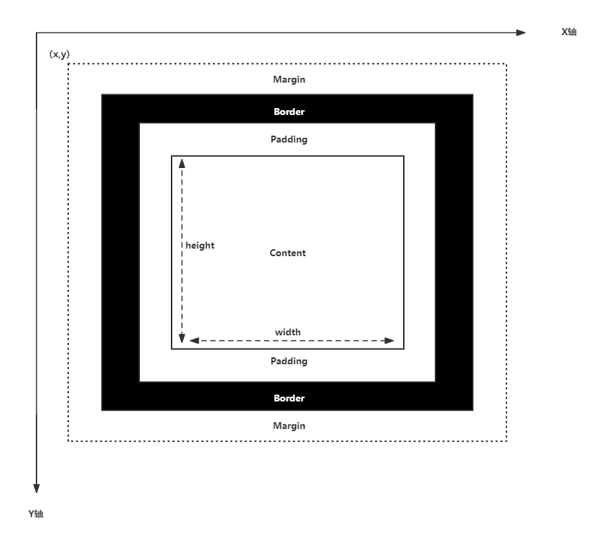
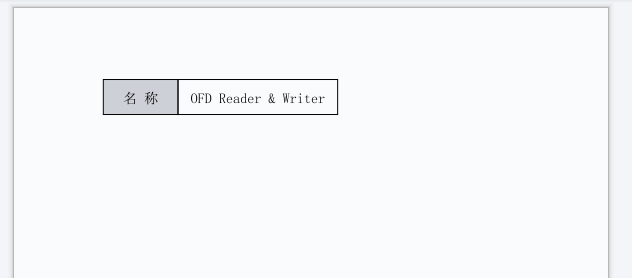

# OFDRW 单元格元素 使用指南

## 基本知识

OFDRW 采用了HTML类似的盒式模型来设计Layout模块的布局方式。

OFD坐标系统为 **左上角为坐标原点**，从 **左到右** 为X轴正方向，从 **上到下** 为Y轴正方向，坐标单位为 **毫米（mm）**。

模型如下所示：



盒式模型依次由：内容（Content）、内边距（Padding）、边框（Border）、外边距（Margin）组成。

盒式模型最边缘为外边距也就是虚线范围，然后依次是边框、内边距、内容。

**注意：内容的宽度和高度是不包含内边距和边框！**

整个模型总宽度和高度如下所示：

- 模型高度 = 上外边距 + 上边框 + 上内边距 + 内容高度 + 下内边距 + 下边框 + 下外边距
- 模型宽度 = 左外边距 + 左边框 + 左内边距 + 内容宽度 + 右内边距 + 右边框 + 右外边距

在OFDRW中当设置元素的X和Y坐标时，是指元素的左上角坐标，也就是元素的左上角外边距的坐标，这一点还请注意！

当在使用Layout模块Canvas元素绘制内容时，绘制区域仅限内容区域(Content)，也就是不包含内边距和边框的区域，超过该区域的内容将会裁剪。

## 快速开始

在OFDRW 2.2.0 以后，增加了Cell元素，同其它元素一样，Cell元素也是一个盒式模型，可设置它的Margin、Padding、Border、Width、Height等属性，你可以将其当做一个普通的Div元素使用。

Cell简化单元类型内容的绘制复杂度，单元内容支持文本、图片，并且支持水平居中、垂直居中等控制。

示例如下所示：

```java
class Main {
    public static void main(String[] args) throws IOException {
        Path outP = Paths.get("cell-col2row1.ofd");
        try (OFDDoc ofdDoc = new OFDDoc(outP)) {
            try (OFDDoc ofdDoc = new OFDDoc(outP)) {
                Cell cell1 = new Cell(20d, 10d);
                cell1.setBorder(0.353);
                cell1.setTextAlign(TextAlign.center);
                cell1.setPadding(1d, 3d, 1d, 3d);
                cell1.setValue("名 称");
                cell1.setFontSize(5d);
                cell1.setDisplay(Display.inlineBlock);
                cell1.setBackgroundColor("#CDD0D6");


                Cell cell2 = new Cell(50d, 10d);
                cell2.setBorder(0.353);
                cell2.setTextAlign(TextAlign.center);
                cell2.setPadding(1d, 3d, 1d, 3d);
                cell2.setValue("OFD Reader & Writer");
                cell2.setFontSize(5d);
                cell2.setMarginLeft(-0.353);
                cell2.setDisplay(Display.inlineBlock);

                ofdDoc.add(cell1);
                ofdDoc.add(cell2);
            }
        }
    }
}
```

> 由于OFDRW在设计时为了让开发者以最低学习成本接入，参考了很多关于HTML的设计，所以您可以发现很多参数与CSS属性较为相似，您可以按照直觉来使用它们。


上述代码使用“流式布局”创建了一个表格，表格为1行2列构成，第1格单元格设置了背景颜色作为单元格的标签，第2个单元格设置了具体的值作表单的值，通过该方式实现了表格的效果，如下所示：



- 完整示例见：[Col2Row1.java](../../src/test/java/org/ofdrw/layout/cases/cell/Col2Row1.java)

除上述方式外您依然可以使用虚拟页面使用固定布局使用Cell元素。

- 更多用法见示例见：[CellTest.java](../../src/test/java/org/ofdrw/layout/element/canvas/CellTest.java)

## 单元格属性设置

Cell元素除了继承自Div元素，除了常规的Div元素设置，Cell元素还支持一些特殊参数的配置如下：

| 函数原型                                          | 用途         |
|:----------------------------------------------|:-----------|
| setValue(String value)                        | 设置文本内容     |
| setValue(Path imgPath, double w, double h)    | 设置图片内容     |
| setTextAlign(TextAlign textAlign)             | 设置文本水平对齐方式 |
| setColor(String color)                        | 设置文本颜色     |
| setFontName(String fontName)                  | 设置文本字体     |
| setFontSize(double fontSize)                  | 设置文本字体大小   |
| setVerticalAlign(VerticalAlign verticalAlign) | 设置文本垂直对齐方式 |
| setLineSpace(Double lineSpace)                | 设置文本行间距    |
| setBold(Boolean bold)                         | 设置文本是否为粗体  |
| setItalic(Boolean italic)                     | 设置文本是否为斜体  |
| setLetterSpacing(Double letterSpacing)        | 设置文本字间距    |
| setUnderline(Boolean underline)               | 设置文本是否有下划线 |
| setDeleteLine(Boolean deleteLine)             | 设置文本是否有删除线 |

## 类表单填入效果实例

若您对OFDRW 区域占位区块 有所了解，您还可以结合上AreaHolderBlock元素，实现类表单生成效果。

若您对AreaHolderBlock元素不了解，可以参考：[区域占位区块](../areaholderblock/README.md)

表单生成示例，如下所示：

```java
class Main {
    public static void main(String[] args) throws IOException {
        Path outP = Paths.get("cell-col2row1-form.ofd");
        try (OFDDoc ofdDoc = new OFDDoc(outP)) {
            Cell cell1 = new Cell(20d, 10d);
            cell1.setBorder(0.353);
            cell1.setTextAlign(TextAlign.center);
            cell1.setPadding(1d, 3d, 1d, 3d);
            cell1.setValue("名 称");
            cell1.setFontSize(5d);
            cell1.setDisplay(Display.inlineBlock);
            cell1.setBackgroundColor("#CDD0D6");


            AreaHolderBlock cell2 = new AreaHolderBlock("name", 50d, 10d);
            cell2.setBorder(0.353);
            cell2.setPadding(1d, 3d, 1d, 3d);
            cell2.setMarginLeft(-0.353);
            cell2.setDisplay(Display.inlineBlock);

            ofdDoc.add(cell1);
            ofdDoc.add(cell2);
        }
    }
}

```

上述代码使用“流式布局”创建了一个表格，表格为1行2列构成，第1格单元格设置了背景颜色作为单元格的标签，第2个单元格使用
AreaHolderBlock 元素设置边框，并且标记了一个名为`name`的占位区域。

效果如下所示：


完整实例代码见：[Col2Row1Form.java](../../src/test/java/org/ofdrw/layout/cases/cell/Col2Row1Form.java)

在生成的OFD文件后，您便可以使用OFDRW Layout模块的 AreaHolderContext
对象，向指定的区域填入内容，详见：[区域占位区块](../areaholderblock/README.md)